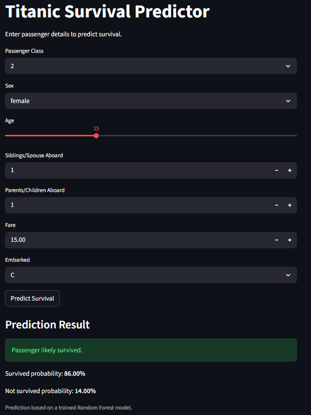

# Titanic Survival Prediction

## Overview

This project predicts whether a passenger survived the Titanic disaster using machine learning techniques. It includes data analysis, feature engineering, model training, evaluation, and a deployed Streamlit application for real-time predictions.

---

## Problem Statement

The goal is to build a classification model that predicts passenger survival based on features such as age, gender, passenger class, fare, and family relationships.

---

## Dataset

The dataset is from the Kaggle Titanic competition. It contains information about passengers including:

- Passenger class (Pclass)
- Sex
- Age
- Number of siblings/spouses aboard (SibSp)
- Number of parents/children aboard (Parch)
- Fare
- Port of embarkation (Embarked)

**Target variable:**
- Survived (0 = No, 1 = Yes)

---

## Data Preprocessing

The following steps were performed:

- **Handled missing values:**
  - Age filled with median
  - Embarked filled with mode
  - Cabin dropped due to excessive missing values

- **Converted categorical variables:**
  - Sex mapped to numeric values
  - Embarked encoded using one-hot encoding

- **Feature engineering:**
  - FamilySize = SibSp + Parch + 1
  - IsAlone derived from FamilySize

- **Removed unnecessary columns:**
  - Name, Ticket, PassengerId

---

## Exploratory Data Analysis

Key observations:

- Female passengers had significantly higher survival rates than males
- First-class passengers had much higher survival rates compared to third-class passengers
- Higher fare (proxy for wealth) is associated with higher survival probability
- Survival depends on a combination of gender, class, and socioeconomic status

---

## Models Used

Two models were trained and compared:

### Random Forest Classifier
- Accuracy: ~83%
- Better performance on non-linear relationships
- Higher recall for survived class

### Logistic Regression
- Accuracy: ~80%
- Simpler model with slightly lower performance

**Final model selected:** Random Forest

---

## Model Evaluation

Random Forest Performance:

- Accuracy: ~83%
- Precision (Survived): ~0.80
- Recall (Survived): ~0.77
- F1-score: ~0.79

**Insights:**

- The model performs well overall
- Slight bias toward predicting non-survival due to class imbalance
- Improved recall after applying class balancing

---

## Feature Importance

Top contributing features:

- Sex
- Fare
- Age
- Pclass

**Interpretation:**

- Gender is the strongest predictor of survival
- Socioeconomic status (fare and class) significantly influences outcomes
- Age also plays an important role

---

## Application

A Streamlit web application was built to allow users to input passenger details and receive a survival prediction.

### Features:

- User input for passenger details
- Real-time prediction using trained model
- Displays survival probability

---

## How to Run

1. Clone the repository

2. Install dependencies:

```bash
pip install -r requirements.txt
```
3. Run the application:
```
streamlit run app/app.py
```

## Application Preview


# Conclusion

The project demonstrates a complete machine learning workflow from data exploration to deployment. The model effectively captures patterns related to gender, class, and socioeconomic status, providing meaningful predictions about passenger survival.
